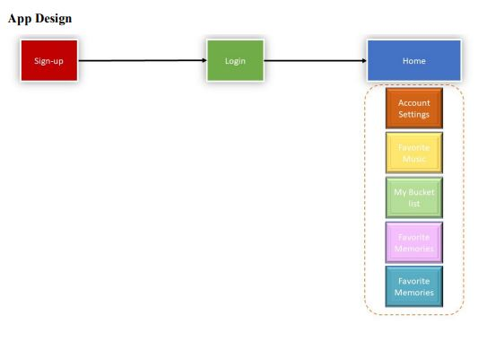

# Introduction / Overview
**Course:** Android Programming

**Assignment:** Project 1

**Description:** In this project, we designed a "Know Me" app that is intended to help users view and record different milestones in their lives. It will also help them maintain a library of their favorite songs.

**Concepts Covered (Weeks 1-4):**
+ Layouts and widgets
+ Event handling
+ Debugging (via Logcat)
+ Creativity

**Note:** Data is saved and shared throughout the project via global variables; no usage of `SharedPreferences` or `SQLiteDatabase` objects.

## Activity Descriptions / Requirements
#### [**Sign-up Screen:**](app/src/main/java/com/example/project1/SignUp.java)
It creates a sign-up page for new users. It has the following fields:
+ Name
+ Gender
+ Age
+ Address
+ Username
    + Must be 5 characters (can be alphanumeric and no space allowed).
    + All lowercase.
+ Password
    + Must be 8 characters (can be alphanumeric and no space allowed).
    + Start with upper case.
    + Contains a number.

#### [**Login screen:**](app/src/main/java/com/example/project1/Login.java)
It is the login screen from where the user can access their account:
+ Username
+ Password
+ Submit
+ Display if the username and password combination is incorrect. Again, since we
have not discussed database objects yet, please use appropriate global variables if
needed.

#### [**Home Page:**](app/src/main/java/com/example/project1/HomePage.java)
This is the main screen that a user sees after they login to their account:
+ Display your name—Example, “Welcome Ana”
+ Display an image
+ Account settings
+ Favorite music
+ My Bucket List
+ Favorite memories
+ Helpful links
+ Disable the back button, i.e. the user should not be able to return back to the login
screen from this activity

#### [**Account Settings:**](app/src/main/java/com/example/project1/AccountSettings.java)
+ Display username, password.
+ Change password—This field should allow the user to change their password.

#### [**Favorite Music:**](app/src/main/java/com/example/project1/FavoriteMusic.java)
This page is more like a dashboard and user cannot make changes. Add
some songs and give the option to the user to play their favorite music.
+ Have an option to select from dropdown instead of the button and play music.
+ Selection from the dropdown menu should navigate to the YouTube page and
play the corresponding song. Uri objects will be helpful for this.

#### [**My Bucket List:**](app/src/main/java/com/example/project1/BucketList.java)
+ Textbox to enter what you wish to do in the future.
+ Save button.
c. Display what was added in step 6a to a checkbox (indicating that the goal was
added to the list).

#### [**Favorite memories:**](app/src/main/java/com/example/project1/FavoriteMemories.java)
*(it is more like a dashboard and does not save values (it displays)).*
+ Values will be predefined on this screen:
    + Title—Subject line.
    + A special/favorite memory—Description of a memory.
+ A related picture.

#### [**Helpful Links:**](app/src/main/java/com/example/project1/HelpfulLinks.java)
+ Add 4 buttons that provide links to some of the informational websites (you pick
the topics).
+ Clicking on these buttons should navigate to the corresponding website.

## Main Application Components
Checkout [src/main Documentation](app/src/main/README.md)
